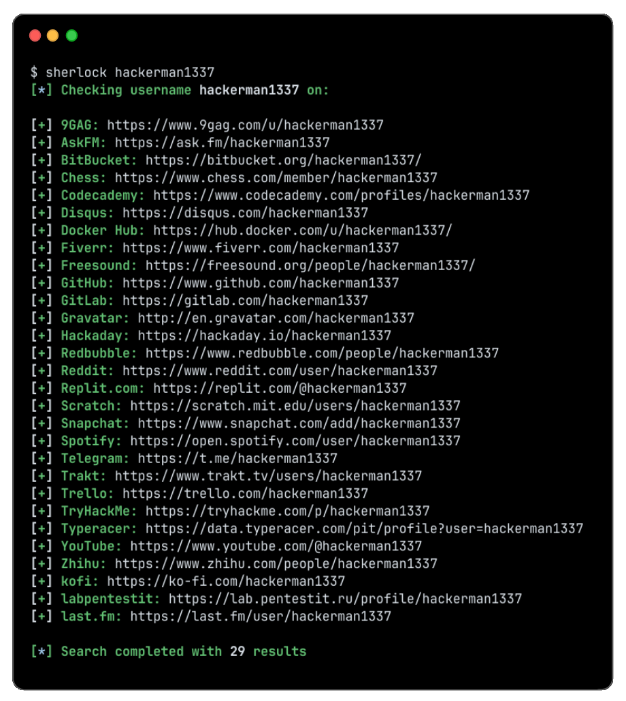

# Sherlock GO

Go rewrite of [Sherlock](https://github.com/sherlock-project/sherlock) — find usernames across 400+ sites.

Same thing as the original, just as a single binary with no Python needed. Results show up as they come in.

This is an independent project by [CHE3MZ](https://github.com/CHE3MZ) and not affiliated with the Sherlock Project. Site data comes from upstream.



## Install

```sh
# installs as `sherlock` in your go/bin
go install github.com/CHE3MZ/sherlock-go/cmd/sherlock@latest

# or build locally
git clone https://github.com/CHE3MZ/sherlock-go.git
cd sherlock-go
go build -o sherlock ./cmd/sherlock
# or: bash tools/build.sh (easier)
```

Needs Go 1.21+.

## Usage

```sh
./sherlock john
./sherlock john --site GitHub --site GitLab --csv --txt
./sherlock john{?} --timeout 15 --print-all
```

Check `./sherlock --help` for all flags. Files (txt/csv/xlsx) are only created when you ask for them with `--txt`, `--csv`, or `--xlsx`.

## Notes

- Uses the same detection logic and site list as the Python version.
- Site list is embedded but can be overridden with `--json` or fetched live.

## Disclaimer

For OSINT / educational use. Only look up usernames you have permission to check and respect site ToS.

## Credits

Original tool and site database by the [Sherlock Project](https://github.com/sherlock-project/sherlock).

## License

MIT — see [LICENSE](./LICENSE).
